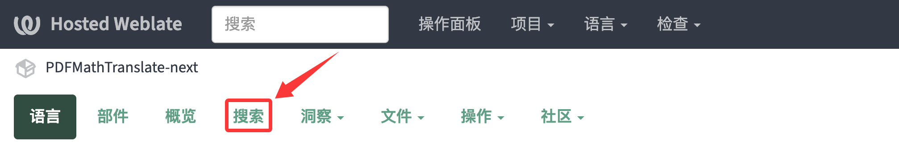
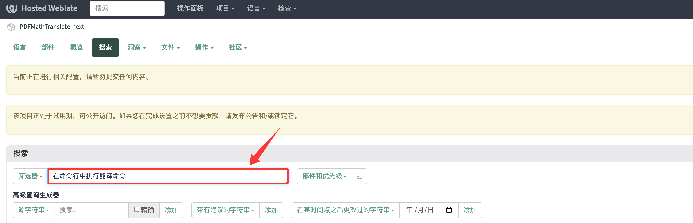
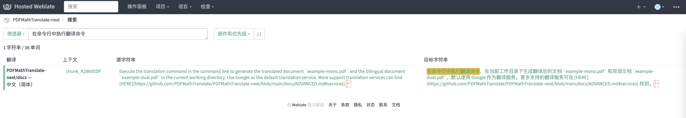
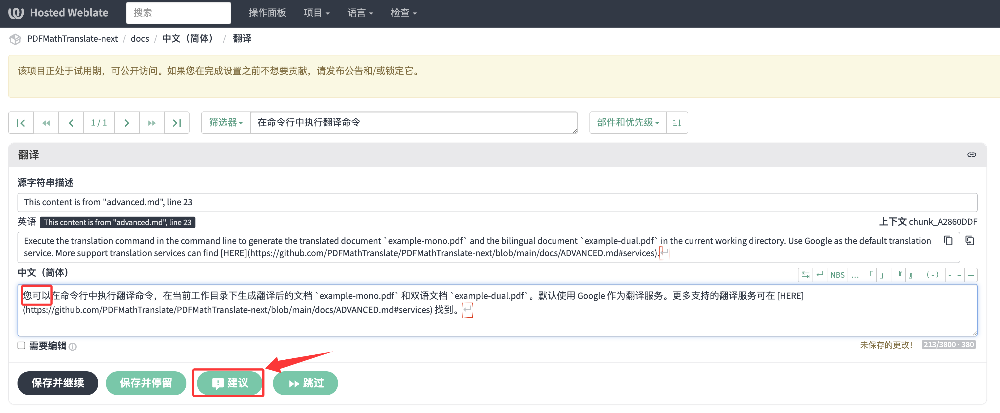

# Sugerindo Melhorias para as Traduções da Documentação

Obrigado pelo seu interesse neste projeto! A documentação não‑inglesa é traduzida automaticamente por modelos de linguagem grandes, portanto, erros são inevitáveis. Se você notar problemas em um idioma com o qual está familiarizado, damos as boas-vindas às suas sugestões de melhoria.

Antes de começar a contribuir, reserve um momento para ler o seguinte guia para ajudar a garantir que suas sugestões possam ser aceitas sem problemas.

# Enviar sugestões via Weblate

Usamos o [Weblate](https://weblate.org/) para gerenciar as traduções da nossa documentação. Você pode verificar o status atual da tradução e enviar sugestões na [página do projeto no Weblate](https://hosted.weblate.org/projects/pdfmathtranslate-next/).

## Como enviar uma sugestão

É muito simples propor melhorias de tradução via Weblate, e você nem precisa registrar uma conta. Continue lendo para ver o processo passo a passo.

Suponha que você queira melhorar a primeira frase na seção "命令行参数" de [高级选项 → 高级](docs/en/advanced/advanced.md):

1. Abra a [página do projeto no Weblate](https://hosted.weblate.org/projects/pdfmathtranslate-next/).

2. Clique em `Search` no topo.

3. Em "Filtro", insira o segmento de texto que deseja encontrar. Texto parcial também é aceito.

Quando terminar, pressione <kbd>Enter</kbd>.

4. Após pressionar <kbd>Enter</kbd>, você será direcionado para a página de resultados da pesquisa. Clique no resultado que preferir para abrir a visualização de edição.

5. Na visualização de edição, faça suas alterações na tradução. Quando terminar, clique em <kbd>Sugerir</kbd>. Pronto—você concluiu com sucesso uma contribuição.

Vamos revisar sua sugestão após ela ser enviada. Uma vez aprovada, suas alterações aparecerão na documentação.

 
<h6><small>Parte do conteúdo desta página foi traduzida pelo GPT e pode conter erros.</small></h6>